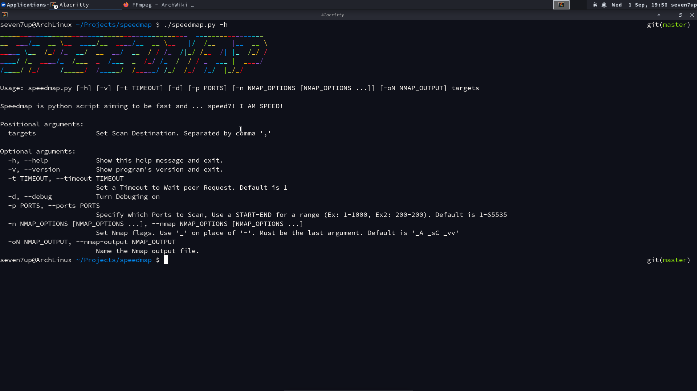
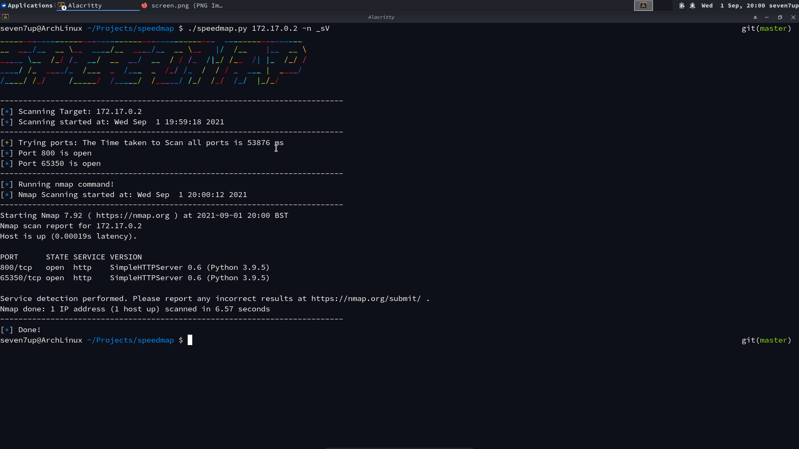

# SPEEDMAP


Works only in Linux and MacOs (Generally on Unix Systems).

## TODO:

- [ ] Build our own logger class (that support progress line printing).
- [ ] Create a C binary source (C is a super fast lang).

### Future Plans:

- [ ] Add support for Windows OS.

## About:



Speedmap is a [`python`](https://python.org/) script which scans a target ports and use the powerfull [`nmap`](https://nmap.org/) to win time for a full ports scan aimed to be fast and ... speed?! I AM SPEED! ;)

## Setup:

The most basic command to run is:

```
pip install git+https://github.com/Seven7Up/speedmap.git
```

Or get the repo as [tarball](https://github.com/Seven7Up/speedmap/archive/master.tar.gz) or [zip](https://github.com/Seven7Up/speedmap/archive/master.zip) or with [`git`](https://git-scm.com/):

```
git clone https://github.com/Seven7Up/speedmap.git
```

Then run setup.py file to Install `speedmap` command:

```
python3 setup.py install
```

## Usage:

To print help use:

```
./speedmap.py -h
```

basic test:

```
./speedmap.py -d localhost
```

All infos are in the help message:

```
_______________________________________________  _________________
__  ___/__  __ \__  ____/__  ____/__  __ \__   |/  /__    |__  __ \
_____ \__  /_/ /_  __/  __  __/  __  / / /_  /|_/ /__  /| |_  /_/ /
____/ /_  ____/_  /___  _  /___  _  /_/ /_  /  / / _  ___ |  ____/
/____/ /_/     /_____/  /_____/  /_____/ /_/  /_/  /_/  |_/_/

Usage: speedmap.py [-h] [-v] [-t TIMEOUT] [-d] [-p PORTS] [-n NMAP_OPTIONS [NMAP_OPTIONS ...]] [-oN NMAP_OUTPUT] targets

Speedmap is python script aiming to be fast and ... speed?! I AM SPEED!

Positional arguments:
  targets               Set Scan Destination. Separated by comma ','

Optional arguments:
  -h, --help            Show this help message and exit.
  -v, --version         Show program's version and exit.
  -t TIMEOUT, --timeout TIMEOUT
                        Set a Timeout to Wait peer Request. Default is 1
  -d, --debug           Turn Debuging on
  -p PORTS, --ports PORTS
                        Specify which Ports to Scan, Use a START-END for a range (Ex: 1-1000, Ex2: 200-200). Default is 1-65535
  -n NMAP_OPTIONS [NMAP_OPTIONS ...], --nmap NMAP_OPTIONS [NMAP_OPTIONS ...]
                        Set Nmap flags. Use '_' on place of '-'. Must be the last argument. Default is '_A _sC _vv'
  -oN NMAP_OUTPUT, --nmap-output NMAP_OUTPUT
                        Name the Nmap output file.
```
